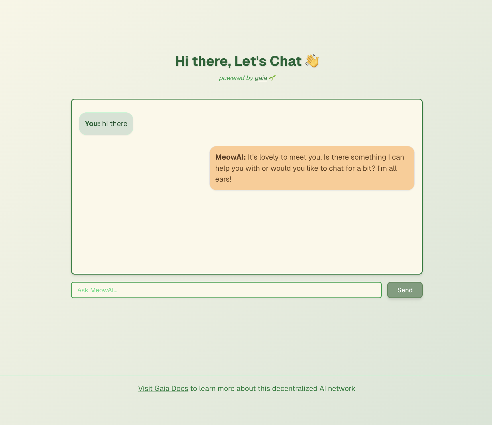

# Gaia Agent Starter



### Next.js Project Setup

1. Clone the repository:

```bash
git clone 
cd Gaia Agent Starter

```

1. Install dependencies:

```bash
pnpm install

```

1. Run the development server:

```bash
 pnpm dev

```

1. Open [http://localhost:3000](http://localhost:3000/) with your browser to see the result.


## Project Structure

The project uses Next.js App Router. You can start editing the page by modifying `app/page.tsx`. The page auto-updates as you edit the file.

## Features

- **Next.js 15**: Utilizes the latest version of Next.js for powerful full-stack capabilities.
- **React Server Components**: Adds components without sending additional client-side JavaScript.
- **Built-in Optimizations**: Automatic image, font, and script optimizations for improved UX and Core Web Vitals.
- **Advanced Routing & Nested Layouts**: Creates routes using the file system, supporting advanced routing patterns and UI layouts.
- **MetaMask Integration**: Secure blockchain interactions and wallet connectivity.
- **GaiaNet AI Integration**: Access to advanced AI functionalities through the Gaia protocol.

## Learn More

- [Next.js Documentation](https://nextjs.org/docs)
- [Learn Next.js](https://nextjs.org/learn)
- [MetaMask Documentation](https://docs.metamask.io/)
- [GaiaNet AI Documentation](https://docs.gaianet.ai/)

## Contributing

Contributions are welcome! Please feel free to submit a Pull Request.